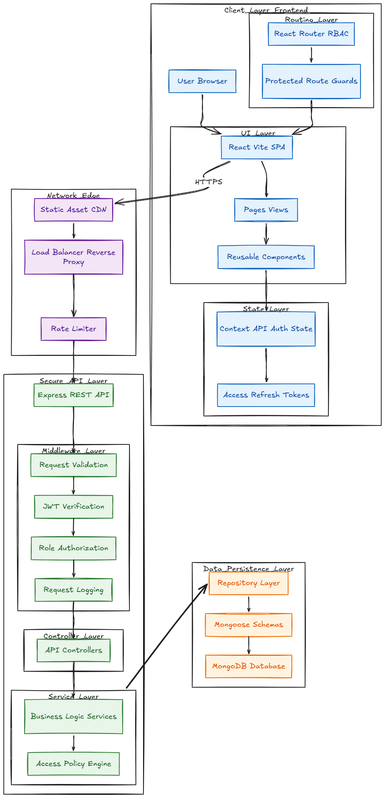

#  Feedback Fusion Campus

> **A Production-Grade Institutional Feedback Management System**  
> *Streamlining academic feedback through secure, role-based digital infrastructure.*

---

##  Executive Summary

**Feedback Fusion Campus** is a comprehensive full-stack web application designed to digitize and analyze academic feedback in educational institutions. It facilitates a transparent, anonymous, and structured feedback loop between Students, Heads of Departments (HODs), and Principals.

Built to address the inefficiencies of manual feedback systems, this platform ensures data integrity, real-time analytics, and secure access controls. It is currently acting as a live production solution, handling complex hierarchical relationships within the campus ecosystem.

---

##  System Architecture

The application follows a **Monolithic Frontend / Service-Oriented Backend** architecture designed for maintainability and clear separation of concerns.



###  Technical Stack

| Domain | Technologies Used |
| :--- | :--- |
| **Frontend** | React.js, Vite, TailwindCSS, Shadcn UI, Framer Motion, Recharts |
| **Backend** | Node.js, Express.js, REST API Architecture |
| **Database** | MongoDB, Mongoose ODM |
| **Security** | JWT (JSON Web Tokens), BCrypt.js, CORS, HttpOnly Cookies |
| **DevOps** | Git, GitHub, Automated Deployments (Vercel/Render) |

---

##  Key Features & Technical Highlights

###  Robust Role-Based Access Control (RBAC)
The core of the system is its security model, ensuring strict data isolation between roles:
- **Principal**: Global oversight, HOD management, and institution-wide analytics.
- **HOD (Head of Department)**: Department-specific management, subject allocation, and faculty performance reports.
- **Student**: Anonymized feedback submission and academic tracking.
- *Implemented via custom higher-order components (HOC) and API middleware.*

###  Interactive Analytics Dashboard
- Visualizes complex datasets using **Recharts**.
- Provides actionable insights like "Average Faculty Rating," "Department Performance Trends," and "Student Engagement Metrics."

###  Optimized Performance
- **Vite-powered** build system for sub-second HMR and optimized production bundles.
- **Lazy Loading** (React.lazy) applied to heavy routes to decrease initial load time (FCP).
- **Debounced Inputs** and optimized API calls to reduce server load.

---

##  Project Leadership & Team Dynamics

**"Innovation through Adaptability"**

This project was conceived and led by a core vision, initially starting with a team of 4 developers. The development lifecycle presented real-world challenges, including team attrition.

- **Adaptive Leadership**: As team members moved on, I transitioned from a specialized role to a **Full-Stack Lead**, bridging the gap between frontend implementation and backend architecture.
- **Resource Management**: Effectively managed the project with a core active team of 2 at any given time, ensuring zero downtime in development velocity.
- **Knowledge Transfer**: Established clear documentation standards (like this README) and modular code structures to allow new or remaining members to pick up tasks instantly.

*This experience demonstrated not just technical coding skills, but the resilience and architectural foresight required to ship production software under shifting constraints.*

---

##  Repository Structure

The codebase is organized to support scalability and ease of navigation:

```bash
Feedback-Fusion/
├── Frontend/             # React SPA (Vite)
│   ├── src/
│   │   ├── components/   # Atomic, reusable UI components (Shadcn)
│   │   ├── contexts/     # Global state (Auth, Theme)
│   │   ├── hooks/        # Custom hooks (useAuth, useFetch)
│   │   └── pages/        # Role-specific page views
├── Backend/              # Node.js API
│   ├── Controllers/      # Business logic segregated by role
│   ├── Models/           # MongoDB schemas with strict typing
│   ├── Routes/           # API endpoint definitions
│   └── middleware/       # Auth verification & error handling
└── README.md             # Project Documentation
```

